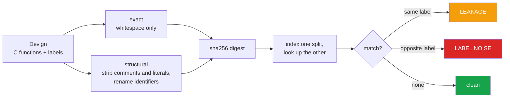

<h1 align="center">devign-leakage (Python · pandas · PyArrow · Hugging Face Hub)</h1>
<p align="center"><i>Is the test set already in the training set?</i></p>

<p align="center">
  <a href="docs/RESULTS.md">Results</a> &middot;
  <a href="docs/METHOD.md">Method</a> &middot;
  <a href="docs/PROBLEMS.md">Problems hit</a> &middot;
  <a href="docs/LIMITATIONS.md">Limitations</a> &middot;
  <a href="docs/FUTURE.md">Future work</a> &middot;
  <a href="#run-it">Run it</a>
</p>

<p align="center">
  <a href="https://github.com/hammasbuilds/devign-leakage/actions/workflows/ci.yml"></a>
  <a href="LICENSE"></a>
  
  
  
  
  <a href="https://github.com/astral-sh/ruff"></a>
</p>

---

> ### Devign's cross-split leakage is smaller than assumed - but every exact duplicate inside its test set carries conflicting labels.

Devign is a standard vulnerability-detection benchmark: C functions labelled vulnerable or
not. A test score only measures generalisation if the splits do not overlap, and only means
anything if the labels are self-consistent.

This measures both, and keeps them apart, because they have different consequences:

- **leakage** - same function, same label, on both sides. A model can score by memorising.
- **label noise** - same function, **opposite** labels. No model can be right on both
  copies, so that slice is **unwinnable by construction**.

---

## The result

`validation` &rarr; `test`, 2,732 rows each:

| | exact | structural |
|---|---:|---:|
| test rows also in validation | **1 (0.04%)** | **27 (0.99%)** |
| ...same label (leakage) | 0 | 22 |
| ...opposite label (noise) | 1 | 5 |

Duplicates **within** the test split itself:

| level | duplicate rows | with conflicting labels |
|---|---:|---:|
| exact | 4 (0.15%) | **4 - all of them** |
| structural | 31 (1.13%) | 12 (0.44%) |

### Two findings, one of them negative

**Cross-split overlap is low.** At 0.04% exact and 0.99% structural, reported Devign scores
are not obviously inflated by copying between splits. **That runs against the assumption
this repo started from**, and it is reported as it came out.

**But the duplicates that exist are labelled inconsistently.** Every one of the four exact
duplicate pairs in the test split carries opposite labels. Whatever a model predicts, it is
scored wrong on one copy of each pair - a small ceiling below 100% that nothing in the
benchmark's reporting mentions.

&#128202; **[Full tables, both splits, every level &rarr;](docs/RESULTS.md)**

---

## How it works



Control flow and C keywords survive structural normalisation, so `if` and `while` never
collapse into each other - only naming and constants are erased.

&#128269; **[Both normalisation levels in detail &rarr;](docs/METHOD.md)**

---

## &#9888; What this repo does NOT measure

**train &rarr; test is not measured here.** That is the comparison that matters most, and
it is missing: the 17.85 MB train split would not download - two attempts produced 0-byte
files while the connection was saturated.

The code path exists and is tested. Once the split is available:

```bash
python src/leakage.py train test
```

Treat every number above as `validation` &harr; `test` only.

---

## Run it

```bash
python src/leakage.py validation test   # the numbers above
python src/leakage.py train test        # once the train split is available
pytest -q                               # 19 tests, no dataset, no network
```

It degrades to validation-only if the train split is absent, rather than refusing to start.

---

## Input


## Output


*Cross-split overlap is far smaller than the leakage literature assumes — one exact row.
The damage is inside a single split: all four exact duplicates in `test` are labelled both
vulnerable and not vulnerable, so four questions are unanswerable no matter what a model
predicts.*

---

## Also worth reading

| | |
|---|---|
| &#128202; **[Results](docs/RESULTS.md)** | Full tables for both splits at both levels |
| &#128269; **[Method](docs/METHOD.md)** | Normalisation, hashing, leakage vs noise |
| &#128736; **[Problems hit](docs/PROBLEMS.md)** | A silent "successful" download, and a wrong prior |
| &#9888; **[Limitations](docs/LIMITATIONS.md)** | Why the structural count is inflated by design |
| &#128640; **[Future work](docs/FUTURE.md)** | train&rarr;test, MinHash, quantifying the ceiling |

---

## Layout

```
src/leakage.py    normalisation, hashing, overlap and duplicate counting
tests/            19 tests on hand-written C - no dataset needed
docs/             detailed documentation
results/          measured output
```

## Stack

`Python 3.11+` &middot; `pandas` &middot; `pyarrow`
&middot; `pytest` &middot; `ruff` &middot; `GitHub Actions` &middot; dataset via
`Hugging Face Hub`

## Keywords

Devign &middot; CodeXGLUE &middot; vulnerability detection &middot; data leakage &middot;
train test contamination &middot; benchmark contamination &middot; duplicate detection
&middot; label noise &middot; dataset quality &middot; code clone detection &middot;
software vulnerability dataset &middot; C code analysis &middot; machine learning for code
&middot; benchmark validity &middot; reproducibility

## Licence

MIT - see [LICENSE](LICENSE).
