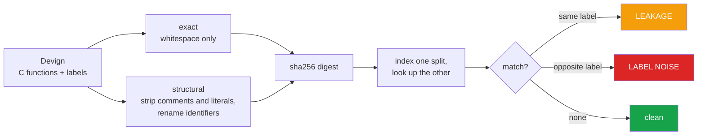

<h1 align="center">devign-leakage (Python · pandas · PyArrow · Hugging Face Hub)</h1>
<p align="center"><i>Is the test set already in the training set?</i></p>

<p align="center">
  <a href="docs/RESULTS.md">Results</a> &middot;
  <a href="docs/METHOD.md">Method</a> &middot;
  <a href="docs/PROBLEMS.md">Problems hit</a> &middot;
  <a href="docs/LIMITATIONS.md">Limitations</a> &middot;
  <a href="docs/FUTURE.md">Future work</a> &middot;
  <a href="#run-it">Run it</a>
</p>

<p align="center">
  <a href="https://github.com/hammasbuilds/devign-leakage/actions/workflows/ci.yml"></a>
  <a href="LICENSE"></a>
  
  
  
  
  <a href="https://github.com/astral-sh/ruff"></a>
</p>

---

> ### Devign's cross-split leakage is smaller than assumed - but every exact duplicate inside its test set carries conflicting labels.

Devign is a standard vulnerability-detection benchmark: C functions labelled vulnerable or
not. A test score only measures generalisation if the splits do not overlap, and only means
anything if the labels are self-consistent.

This measures both, and keeps them apart, because they have different consequences:

- **leakage** - same function, same label, on both sides. A model can score by memorising.
- **label noise** - same function, **opposite** labels. No model can be right on both
  copies, so that slice is **unwinnable by construction**.

---

## The result

`train` &rarr; `test` - the comparison that decides whether a Devign score means anything.
21,854 training rows against 2,732 test rows:

| | exact | structural |
|---|---:|---:|
| test rows also present in train | **10 (0.37%)** | **192 (7.03%)** |
| ...same label (leakage) | 2 | **152** |
| ...opposite label (noise) | 8 | 51 |

Duplicates **within** the test split itself:

| level | duplicate rows | with conflicting labels |
|---|---:|---:|
| exact | 4 (0.15%) | **4 - all of them** |
| structural | 31 (1.13%) | 12 (0.44%) |

### The number was seven times smaller when measured against the wrong split

An earlier version of this repo could not download the 17.85 MB train split and reported
`validation` &rarr; `test` instead, where structural overlap is **0.99%**. It concluded that
cross-split overlap was low and that Devign scores were probably not inflated.

Against the split models are actually trained on, structural overlap is **7.03%** - and 152
test rows are structural duplicates of a training row *carrying the same label*. Those are
free marks: a model that memorises them scores on 5.6% of the test set without generalising
at all.

The earlier conclusion was not a wrong reading of the data. It was the right reading of the
wrong pair, which is worse, because nobody trains on the validation split.

**The inconsistent labelling holds up.** Every one of the four exact duplicate pairs inside
the test split carries opposite labels, so whatever a model predicts it is scored wrong on
one copy of each pair - a ceiling below 100% that the benchmark's reporting does not mention.

&#128202; **[Full tables, both splits, every level &rarr;](docs/RESULTS.md)**

---

## And a benchmark nobody can beat by reading code

The leakage above is real but small. That raises the obvious follow-up: if the dataset is
mostly clean, what do the published numbers on it actually mean?

Devign's test split is 1477 safe to 1255 vulnerable, so **answering SAFE every time and
reading nothing scores 50.4%** on a sample of 800. Published accuracies cluster near 62%.
That is eight points of headroom.

`qwen2.5-coder:14b`, asked one C function at a time, temperature 0:

```
accuracy            50.0%        <- the model
majority baseline   50.4%        <- a constant answer
difference          -0.4%

confusion: tp 220  tn 180  fp 217  fn 183
```

**It is 0.4 points below a constant.** The confusion matrix shows why: it answered
VULNERABLE 437 times out of 800, against a true rate of 50.4%, and got them right at
close to the rate you would expect from a coin. It is not detecting vulnerabilities and
failing to be accurate - it is not detecting them at all.

Removing the conflicting-label rows moves accuracy by +0.1%, which settles the other
question this repo raised: the label noise is **real but far too rare to explain anyone's
number**. That matters because "the dataset is noisy" is the convenient excuse, and it does
not hold.

None of this says a fine-tuned classifier cannot beat the baseline - published ones do,
narrowly. It says a general-purpose coder model prompted for the task performs at chance,
and that a benchmark with eight points of headroom is a place where small reported gains
deserve a majority-baseline column next to them.

## How it works



Control flow and C keywords survive structural normalisation, so `if` and `while` never
collapse into each other - only naming and constants are erased.

&#128269; **[Both normalisation levels in detail &rarr;](docs/METHOD.md)**

---

## &#9888; What this repo does NOT measure

**The `detect.py` arm is still 800 rows, not the full test split.** Classifying all 2,732
would take roughly four GPU-hours on this machine and has not been run.

**Only two normalisation levels.** Exact and structural. A semantic level - renaming
variables, reordering independent statements - would find more overlap, and its absence
means 7.03% is a floor rather than an estimate.

---

## Run it

```bash
python src/leakage.py train test        # the numbers above
python src/report.py  train test        # and write them to results/
python src/leakage.py validation test   # the earlier, smaller comparison
pytest -q                               # 19 tests, no dataset, no network
```

It degrades to validation-only if the train split is absent, rather than refusing to start.

---

## Input


## Output


*Cross-split overlap is far smaller than the leakage literature assumes — one exact row.
The damage is inside a single split: all four exact duplicates in `test` are labelled both
vulnerable and not vulnerable, so four questions are unanswerable no matter what a model
predicts.*

---

## Also worth reading

| | |
|---|---|
| &#128202; **[Results](docs/RESULTS.md)** | Full tables for both splits at both levels |
| &#128269; **[Method](docs/METHOD.md)** | Normalisation, hashing, leakage vs noise |
| &#128736; **[Problems hit](docs/PROBLEMS.md)** | A silent "successful" download, and a wrong prior |
| &#9888; **[Limitations](docs/LIMITATIONS.md)** | Why the structural count is inflated by design |
| &#128640; **[Future work](docs/FUTURE.md)** | train&rarr;test, MinHash, quantifying the ceiling |

---

## Layout

```
src/leakage.py    normalisation, hashing, overlap and duplicate counting
tests/            19 tests on hand-written C - no dataset needed
docs/             detailed documentation
results/          measured output
```

## Stack

`Python 3.11+` &middot; `pandas` &middot; `pyarrow`
&middot; `pytest` &middot; `ruff` &middot; `GitHub Actions` &middot; dataset via
`Hugging Face Hub`

## Keywords

Devign &middot; CodeXGLUE &middot; vulnerability detection &middot; data leakage &middot;
train test contamination &middot; benchmark contamination &middot; duplicate detection
&middot; label noise &middot; dataset quality &middot; code clone detection &middot;
software vulnerability dataset &middot; C code analysis &middot; machine learning for code
&middot; benchmark validity &middot; reproducibility

## Licence

MIT - see [LICENSE](LICENSE).
